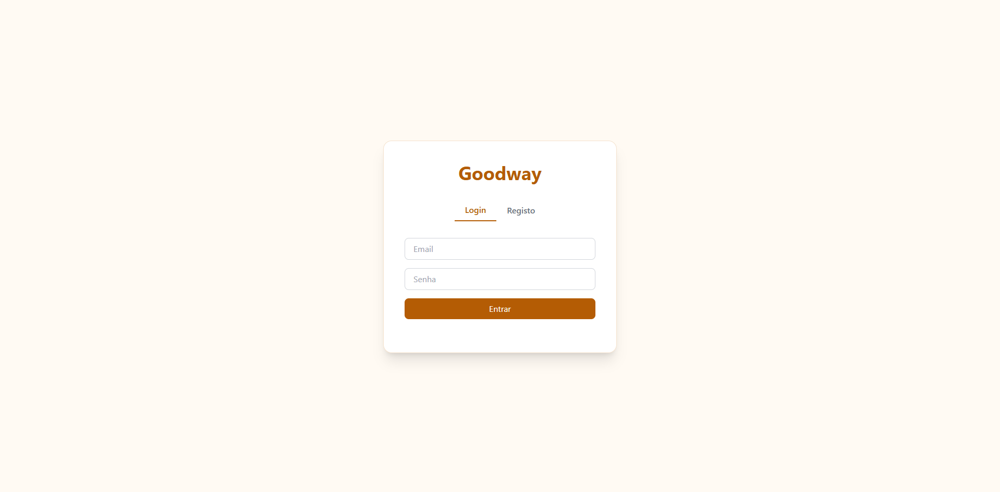
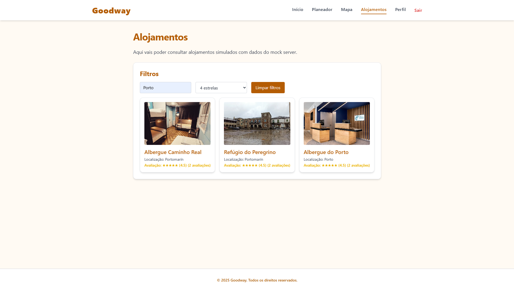
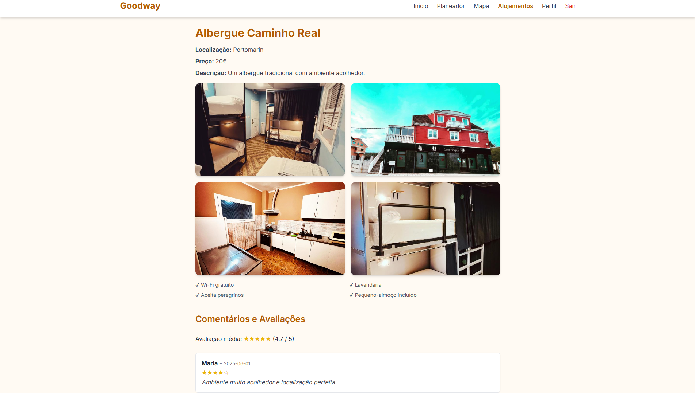
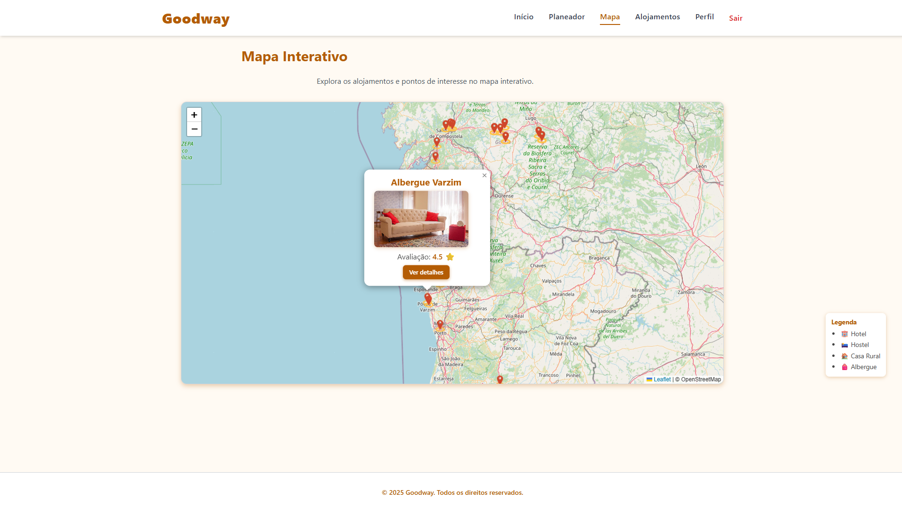
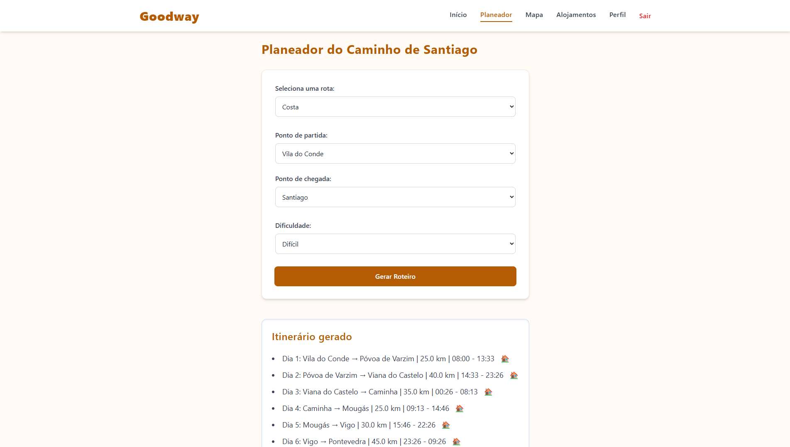

# 🌄 Goodway — Planeador Personalizado do Caminho de Santiago

> 🔗 A aplicação está disponível em: **[https://goodway-esmad.netlify.app/](https://goodway-esmad.netlify.app/)**


> **Goodway** é uma aplicação web que permite planear o Caminho de Santiago de forma personalizada, visualizando rotas, alojamentos, comentários e pontos de interesse de forma interativa e acessível.

---

## ✨ Funcionalidades Principais

- 📍 **Mapa Interativo** com marcadores de alojamentos e locais relevantes.
- 🛌 **Lista de Alojamentos** com filtros por localização e avaliação.
- 💬 **Sistema de Comentários** com avaliação por estrelas e armazenamento local.
- 🔐 **Autenticação Local** com Login / Registo usando `localStorage`.
- 📄 **Página de Detalhes do Alojamento** com fotos, comodidades e comentários.
- 🧭 **Geração de Rota Personalizada** baseada nas preferências do utilizador.
- ⚡ **Mock Server** simula chamadas a uma API usando JS modular.
- 🎨 **Design Responsivo e Coerente** com o tema visual do Caminho de Santiago.

---

## 🧱 Tecnologias e Ferramentas Utilizadas

| Tecnologia       | Descrição                                                             |
| ---------------- | --------------------------------------------------------------------- |
| `HTML` / `CSS`   | Estrutura base das páginas e estilo básico.                           |
| **TailwindCSS**  | Framework utilitária para estilização rápida e responsiva.            |
| `JavaScript` ES6 | Lógica do cliente, manipulação do DOM e simulação de backend.         |
| `LocalStorage`   | Armazenamento local de utilizadores, sessões e comentários.           |
| `Mock Server`    | Módulo JS com dados simulados de alojamentos e comentários (`mock/`). |
| `Lightbox`       | Visualização de imagens em tela cheia com efeito sobreposto.          |
| `Modular JS`     | Código organizado por páginas e responsabilidades.                    |

---

## 📸 Capturas de Ecrã

### 🟠 Página de Login / Registo



### 🟡 Lista de Alojamentos com Filtros



### 🟢 Detalhes de Alojamento com Comentários



### 🔵 Mapa Interativo com Alojamentos



### 🟣 Geração de Rota Personalizada



---

## ✅ Como Usar

1. Clona o repositório:
   ```bash
   git clone https://github.com/teu-usuario/goodway.git
   cd goodway
   ```
2. Abre `index.html` num browser (Chrome, Edge, Firefox).
3. Recomenda-se usar a extensão **Live Server** no VSCode para melhor experiência.

---

## 📌 Notas Finais

- O sistema de autenticação é **simulado** com `localStorage`.
- Todos os dados são **mockados** para demonstração, sem backend real.
- A aplicação está preparada para ser facilmente adaptada para APIs reais.
